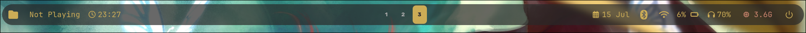
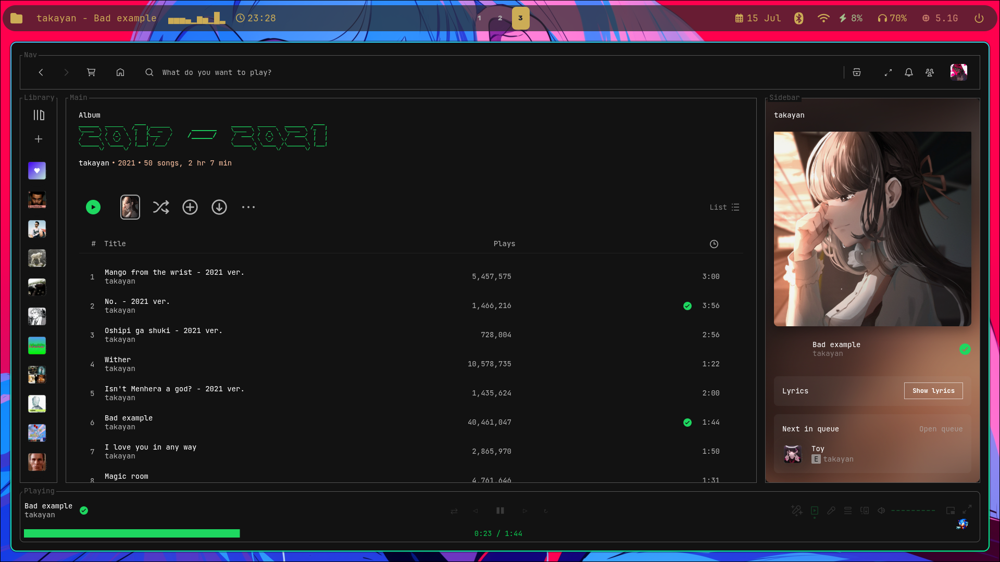
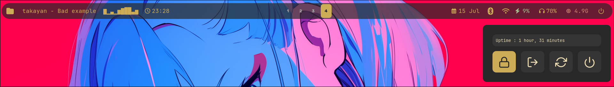

# 🟫 Gruvbox Waybar Config

This is my custom **Waybar configuration** for Hyprland using the **Gruvbox color scheme**. It includes useful modules, custom scripts, and a minimal, aesthetic setup.

> ✅ Includes JSON config, CSS styling, and preview screenshot.

---

## 📷 Preview





---

## 📁 Folder Structure

```~/.config/waybar/
├── config.jsonc # Waybar module configuration
├── style.css # Gruvbox themed styling
├── modules/ # Custom scripts used by waybar modules
│ └── now-playing.sh # Example: music player module (via playerctl)
├── scripts/
│ └── battery-notify.sh # Battery warning script
```

## 🧩 Included Modules

| Position    | Modules                                                                 |
|-------------|--------------------------------------------------------------------------|
| `left`      | File Manager button, Now Playing (Spotify), Clock                        |
| `center`    | Hyprland Workspaces with icons                                           |
| `right`     | Date, Bluetooth, Wi-Fi, Battery %, Volume, Memory, Power Menu            |

---
## ⚙️ Setup Instructions

### 1. Clone the Repo

```bash
git clone https://github.com/Doffy4102/gruvbox-waybar

```
Or clone it anywhere and symlink the files into `~/.config/waybar`
and copy the files of repo and replace the exisitng config files of waybar

### 2. Make Scripts Executable

```bash
chmod +x ~/.config/waybar/modules/*.sh
chmod +x ~/.config/waybar/scripts/*.sh
```

### 3. Install Required Dependencies
`Waybar`

`Playerctl (for now-playing)`

`NetworkManager + nm-connection-editor (for Wi-Fi)`

`blueman (for Bluetooth)`

`pavucontrol (for volume)`

`rofi (used in the power menu)`

`Thunar (file manager, used in "Files" module)`

### 5. Add your own Rofi Theme
Change this in the config file
```bash
"on-click": "~/.config/rofi/YOUR_THEME"
```

## 🎨 Customize
Fonts: 'JetBrainsMono Nerd Font' recommended

Theme colors can be changed in style.css (#ccac56, etc.)

Icon sets use [Nerd Fonts] (https://www.nerdfonts.com)

## 💡 Tips

Scripts inside `modules/` are lightweight shell scripts that you can modify freely.

`battery-notify.sh` alerts you when battery is critically low.

Waybar is reloadable with:
```
pkill waybar && waybar &
```

## 📜 License

MIT License — free to use and modify.

## 🤝 Contribute

Feel free to fork and improve! Open to PRs and suggestions to enhance the Gruvbox Waybar even more.
